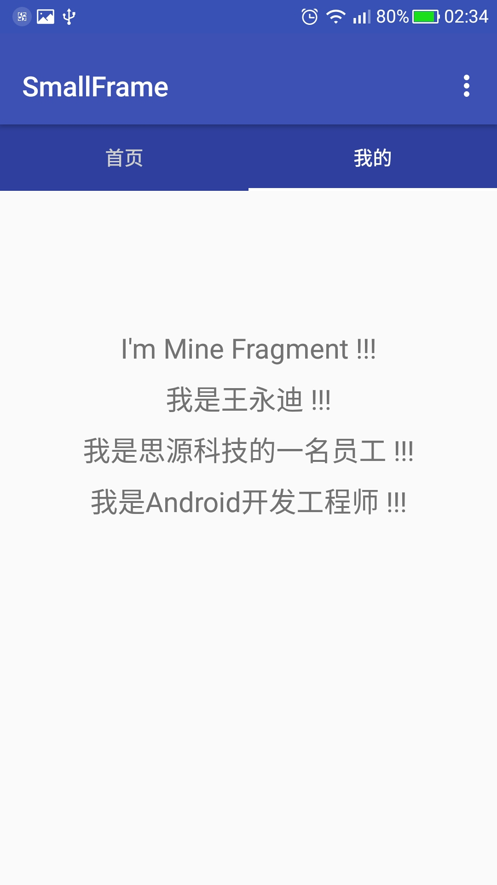
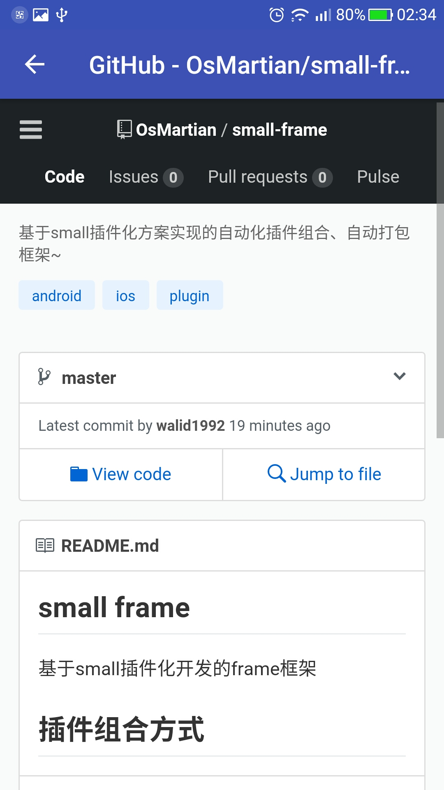

## small frame for android

> 基于small插件化方案实现的动态插件组合、自动打包框架~ 

## 原理介绍

> small 插件化方案分为两个步骤

1. gradle 打包插件机制
2. 运行期加载机制

### 打包插件机制

[官方说明](https://github.com/wequick/Small/tree/master/Android/DevSample/buildSrc)

> 将多个app与lib工程编译成so文件

### 运行期加载机制

#### Dynamic load classes

[官方说明](https://github.com/wequick/Small/wiki/Android-dynamic-load-classes)

> DexClassLoader不支持".so"后缀，为了让应用启动时能自动复制插件包到应用存储目录，需要支持".so"后缀。做法就是模拟 压缩包加载代码块，创建一个dex元素，再反射添加到宿主class loader里的dexPathList。

#### Dynamic load resources

[官方说明](https://github.com/wequick/Small/wiki/Android-dynamic-load-resources)

#### Dynamic register activities

##### activity 启动过程：

> 注： Android activities受Instrumentation监控

1. 由Activity的startActivityForResult方法启动，通过instrumentation的execStartActivity方法激活生命周期。
2. 在ActivityThread的performLaunchActivity方法中通过instrumentation的newActivity方法实例化。

##### small 实现方案：

**1. 首先在宿主manifest中注册一个命名特殊的占坑activity**

```
<!-- Stub Activities -->
<activity android:name=".A.0" android:launchMode="standard"/>
```

**2. 封装一个instrumentation，替换掉宿主的**

（1）、欺骗startActivityForResult(启动过程1)以获得生命周期
（2）、欺骗performLaunchActivity(启动过程2)来创建插件activity实例

```
ActivityThread thread = currentActivityThread();
Instrumentation base = thread.@mInstrumentation;
Instrumentation wrapper = new InstrumentationWrapper(base);
thread.@mInstrumentation = wrapper;

class InstrumentationWrapper extends Instrumentation {
    // 欺骗startActivityForResult获得生命周期
    public ActivityResult execStartActivity(..., Intent intent, ...) {
        fakeToStub(intent);
        base.execStartActivity(args);
    }

    // 欺骗performLaunchActivity创建实例
    @Override
    public Activity newActivity(ClassLoader cl, String className, Intent intent) {
        className = restoreToReal(intent, className);
        return base.newActivity(cl, className, intent);
    }
} 
```


## 项目结构

```
small-frame
├── app (宿主app)
│      ├── LaunchActivity  
│      │  
│      └── SmallApp
│
├── app.main （宿主app选择加载的主模块）
│      └── MainActivity
│
│
├── app.home （首页模块app）
│      └── MainFragment
│
│
├── app.mine （我的模块app）
│      └── MainFragment
│      
│          
├── app.detail （详情模块app）
│      ├── MainActivity
│      │   
│      └── SubActivity
│           
└── lib.style （公共样式库）
       └── res
           ├── colors.xml
           ├── dimens.xml
           └── styles.xml
```

## 路由管理

1、 跳转h5

```
  Small.openUri("https://github.com/OsMartian/small-frame", getContext());
```

2、 跳转app module 传值

```
  Small.openUri("detail?params=我是参数，从首页传送过来的~", getContext());
```

3、 跳转app module 二级界面

```
  Small.openUri("detail/sub", getContext());
```

## 示例图片





