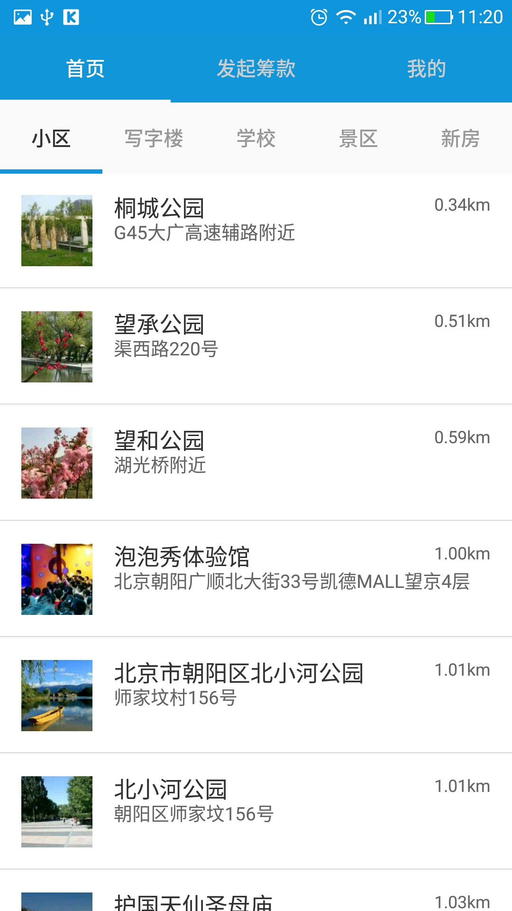

# 打包top框架说明

* config 文件配置

```
{
  baseInfo: {
    applicationId: 'com.syswin.toon.top',
    versionCode: 2,
    appIcon: 'top',
    appName: 'TOP框架',
    versionName: '1.0.1'
  },
  frame: {
    uri: 'top',
    tags: [
      {
        name: '首页',
        uri: 'home'
      },
      {
        name: '发起筹款',
        uri: `weex?url=${encodeURIComponent(`http://${ipAddress}:12580/dist/weex/views/launch/app.js`)}`
      },
      {
        name: '我的',
        uri: `weex?url=${encodeURIComponent(`http://${ipAddress}:12580/dist/weex/views/mine/app.js`)}`
      }
    ]
  },
  modules: {
    version: '1.0.0',
    bundles: [
      {
        uri: 'top',
        pkg: 'com.osmartian.small.app.top'
      },
      {
        uri: 'home',
        pkg: 'com.osmartian.small.app.home'
      },
      {
        uri: 'weex',
        pkg: 'com.osmartian.small.app.weex'
      },
      {
        uri: 'lib.weex',
        pkg: 'com.osmartian.small.lib.weex'
      },
      {
        uri: 'lib.martian',
        pkg: 'com.osmartian.small.lib.martian'
      },
      {
        uri: 'lib.style',
        pkg: 'com.osmartian.small.lib.style'
      }
    ]
  }
}

```

### 示例图片




